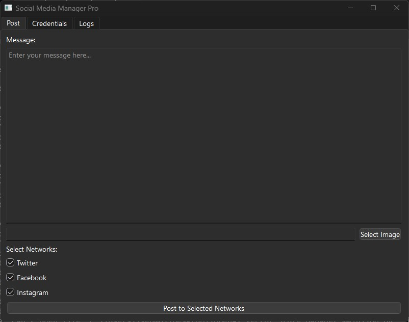

# Social Media Poster GUI 
#### (Social Media Manager Pro)

A cross-platform desktop application for posting to multiple social networks with API integration.

## Features

- 📱 Post to Twitter, Facebook, Instagram
- 🖼️ Image attachment support
- 📝 Message drafting with character counter
- 🔐 Secure credential storage
- 📋 Activity logging

## Installation

```bash
pip install tweepy facebook-sdk instabot PySide6
```

## Usage

1. Enter API credentials in Settings tab
2. Compose message (280 chars max for Twitter)
3. Select image (optional, required for Instagram)
4. Choose platforms
5. Click "Post"

## Configuration

Add your API credentials:
- Twitter: API Key/Secret, Access Token/Secret
- Facebook: Access Token
- Instagram: Username/Password

## Notes

- Requires valid API keys from each platform
- Test with dummy accounts first
- Instagram posts require an image

### Screenshot



